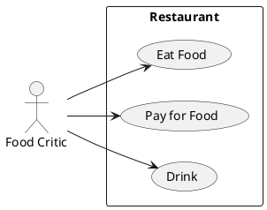

# Описание требований и архитектуры

## Введение
<!-- Общее краткое описание создаваемой системы -->
В рамках курса осуществляется проектирование решения на основе [постановки задачи от "заказчика"](../../task.md).

- [Описание требований и архитектуры](#описание-требований-и-архитектуры)
  - [Введение](#введение)
  - [Заинтересованные стороны](#заинтересованные-стороны)
  - [Бизнес-контекст (бизнес-требования)](#бизнес-контекст-бизнес-требования)
      - [BR-1 Возможность предварительной регистрации слушателей](#br-1-возможность-предварительной-регистрации-слушателей)
      - [BR-2 Возможность подачи заявки докладчиками](#br-2-возможность-подачи-заявки-докладчиками)
      - [BR-3 Возможность рассказать посетителям сайта о предстоящей конференции](#br-3-возможность-рассказать-посетителям-сайта-о-предстоящей-конференции)
      - [BR-4 Возможность оплаты билета через сторонний сторонний сервис](#br-4-возможность-оплаты-билета-через-сторонний-сторонний-сервис)
      - [BR-5 Возможность рассказать о прошедших конференциях](#br-5-возможность-рассказать-о-прошедших-конференциях)
      - [BR-6 Возможность собирать различные метрики со страниц для проведения аналитики](#br-6-возможность-собирать-различные-метрики-со-страниц-для-проведения-аналитики)
      - [BR-7 Возможность участникам выбирать слот для доклада в расписании](#br-7-возможность-участникам-выбирать-слот-для-доклада-в-расписании)
      - [BR-8 Возможность собирать обратную связь с участников](#br-8-возможность-собирать-обратную-связь-с-участников)
      - [BR-9 Возможность трансляции конференции](#br-9-возможность-трансляции-конференции)
      - [BR-10 Отображение конференции](#br-10-отображение-конференции)
      - [BR-11 Возможность вернуть обратную связь на поданную заявку на доклад в форме чата](#br-11-возможность-вернуть-обратную-связь-на-поданную-заявку-на-доклад-в-форме-чата)
      - [BR-12 Возможность отрецензировать доклад, вернуть обратную связь в форме чата](#br-12-возможность-отрецензировать-доклад-вернуть-обратную-связь-в-форме-чата)
      - [BR-13 Возможность получить вопрос от докладчика в формате чата](#br-13-возможность-получить-вопрос-от-докладчика-в-формате-чата)
  - [Глоссарий](#глоссарий)
  - [Модель предметной области](#модель-предметной-области)
  - [Требования к системе](#требования-к-системе)
    - [Сценарии использования (Use case)](#сценарии-использования-use-case)
    - [Функциональные требования](#функциональные-требования)
    - [Нефункциональные требования/Требования к атрибутам качества](#нефункциональные-требованиятребования-к-атрибутам-качества)
    - [Ограничения](#ограничения)
  - [Архитектура](#архитектура)
    - [Журнал архитектурных решений](#журнал-архитектурных-решений)
    - [Контекст решения](#контекст-решения)
    - [Компонентная архитектура](#компонентная-архитектура)
    - [Реализация сценариев использования](#реализация-сценариев-использования)
    - [Программные интерфейсы](#программные-интерфейсы)
    - [Схема развертывания](#схема-развертывания)
  
## Заинтересованные стороны
<!-- Перечень заинтересованных сторон и их интересов по отношению к создаваемой системе. 
Подробнее: https://confluence.mts.ru/pages/viewpage.action?pageId=399975538 
-->
| Заинтересованная сторона | Интересы               |
|:-------------------------|:-----------------------|
| Спикеры                | Подать заявку на доклад, выступить, получить обратную связь         |
| Слушатели                | Зарегестрироваться как слушатель, оставить отзыв получать информационные рассылки, просматривать конференцию, просматривать расписание |
| Владельцы helloconf      | Рассказать о платформе, дать возможность подать  заявку, рассматривать заявки, информировать о дате и месте проведения, дать возможность зарегестрироваться в качестве слушателя, выложить записи с предыдущих конференций и информацию о спикерах. Составление расписания. Транслирование конференции.  Просматривать различные метрики о кликах, переходах, просмотрах  |
| Команда эксплуатации     | Возможность понимать, когда платформа работает удовлетворительно или когда работоспособность нарушена. Возможность фиксирования инцидентов и передачи их в команду разработки |
 

## Бизнес-контекст (бизнес-требования)
<!-- Общее описание бизнес-контекста создаваемой системы (автоматизируемой деятельности), список бизнес-целей заинтересованных сторон 
Подробнее: https://confluence.mts.ru/pages/viewpage.action?pageId=399973845
-->
#### BR-1 Возможность предварительной регистрации слушателей
#### BR-2 Возможность подачи заявки докладчиками
#### BR-3 Возможность рассказать посетителям сайта о предстоящей конференции
#### BR-4 Возможность оплаты билета через сторонний сторонний сервис 
#### BR-5 Возможность рассказать о прошедших конференциях
#### BR-6 Возможность собирать различные метрики со страниц для проведения аналитики
#### BR-7 Возможность участникам выбирать слот для доклада в расписании
#### BR-8 Возможность собирать обратную связь с участников
#### BR-9 Возможность трансляции конференции
#### BR-10 Отображение конференции
#### BR-11 Возможность вернуть обратную связь на поданную заявку на доклад в форме чата
#### BR-12 Возможность отрецензировать доклад, вернуть обратную связь в форме чата
#### BR-13 Возможность получить вопрос от докладчика в формате чата

## Глоссарий
<!-- Содержит основные понятия и термины предметной области  
Подробнее: https://confluence.mts.ru/pages/viewpage.action?pageId=375782595
-->
| Понятие                        | Определение                       |
|:-------------------------------|:----------------------------------|
| Спикер | Человек, который будет читать лекцию на конференции |
| Докладчик | Докладчик == спикер |
| Лекция | Доклад, который рассказывает спикер |
| Слушатель | Человек, оплативший билет на конференцию |
| Конференция | Мероприятие, которое может профодиться онлайн и/или оффлайн, на котром различные спикеры читают свои лекции для слушателей, основной продукт бизнеса|

## [Модель предметной области](data/DomainModel.md)

## Требования к системе

SR-01 Количество одновременно смотрящих трансляцию слушателей 15000
SR-02 DAU в обычное время 100
SR-03 DAU в преддверии конференции 10000
SR-04 Количество регистраций на конференцию в день до 6000
SR-05 Количество подач докладов в день до 1000
SR-06 Три вида пользователей: администраторы, спикеры, слушатели
SR-07 Работа с докладчиками в виде чата в реальном времени для администраторов
SR-08 Ожидание открытия страницы оплаты не более 4 секунд
SR-09 Система должна быть доступна 99% времени в год
SR-10 Не должно происходить таких ситуаций, когда два лектора забронировали один и тот же таймслот

### Сценарии использования (Use case)
<!-- Подробное описание сценариев использования системы с привязкой к ролям участников и задействованным бизнес-сущностям 
https://confluence.mts.ru/pages/viewpage.action?pageId=375782108 
https://confluence.mts.ru/pages/viewpage.action?pageId=375782119 
-->
#### Диаграмма сценариев использования (Use Case Diagram) <!-- omit in toc -->

#### Список сценариев использования <!-- omit in toc -->

| ID     | Описание                                          |
|--------|---------------------------------------------------|
| UC.001 | *[Название сценария использования](uc/uc.001.md)* |

### Функциональные требования
<!-- Описание требований к функциям, реализуемым системой. Требование может быть привязано к сценарию использования или быть общим 
Подробнее: https://confluence.mts.ru/pages/viewpage.action?pageId=375782501 
-->
| ID     | Функциональное требование             |
|--------|---------------------------------------|
| FR.001 | Возможность загружать контент на сайт для описания предстоящей конференции 
| FR.002 | Просматривать описание предстоящей конференции 
| FR.003 | Регестрироваться на предстоящую конференцию 
| FR.004 | Оплачивать билеты через сторонний сервис 
| FR.005 | Добавлять разделы с прошедшими конференциями 
| FR.006 | Отображать записи прошедших конференций с Youtube 
| FR.007 | Отображать информацию о спикерах с прошедших конференций в их разделах рядом с видео 
| FR.008 | Возможность подать заявку на конференцию 
| FR.009 | Выбор слота в расписании для участника с учетом уже занятых позиций
| FR.010 | Просмотр расписания слушателем
| FR.011 | Трансляция конференции зарегестрированным слушателям и участникам
| FR.012 | Сбор обратной связи с зарегестрированных слушателей
| FR.013 | Рассылка обратной связи участникам
| FR.014 | Сбор обратной связи от участников
| FR.015 | Просмотр всех обратных связей владельцами
| FR.016 | Возможность общаться с докладчиками в чате
| FR.017 | Возможность вернуть обратную связь докладчикам в чате
| FR.018 | Возможность просматривать заявки на доклады в чате
| FR.019 | Возможность предварительно просматривать доклады в чате

### Нефункциональные требования/Требования к атрибутам качества
<!-- Требования к основным архитектурным характеристикам (атрибутам качества) системы - надежность, масштабируемость, ИБ, и др.
Подробнее: https://confluence.mts.ru/pages/viewpage.action?pageId=375782530
-->

| ID     | Атрибут качества             | Описание требования                       | Методика мониторинга |
|--------|------------------------------|-------------------------------------------|-------------------------------------------|
| QR.001 | Доступность 99% | Вся система должна быть доступна пользователю 99 процентов времени в год, то есть время простоя не должно превышать более 3.65 дней в год| Логировать каждую успешно открытую страницу и каждую не успешно открытую страницу |
| QR.002 | Одновременная поддержка 1500 соединений | Сайт должен поддерживать 1500 соединений во время трансляции лекции|
| QR.003 | Поддержка 1 RPS в обычные дни | Поддержка 1 RPS в дни, когда не проводится рекламных акций, привлекающих посетителей| Логирование каждого полученного запроса и времени, когда он был получен |
| QR.004 | Поддержка 3 RPS в дни, когда проводятся рекламные акции и в преддверии конференции| Поддержка 3 RPS в дни, когда проводятся рекламные акции или за 14 дней до конференции и после| Логирование каждого полученного запроса и времени, когда он был получен|
| QR.005 | Поддержка 15000 RPS в дни конференции????| Поддержка 15000 RPS в дни конференции| Логирование каждого полученного запроса и времени, когда он был получен|
| QR.006 | 1 Record per second | Поддержка 1 записи в секунду для регистрации пользователей|
| QR.007 | 1 Record per second | Поддержка 1 записи в секунду для подачи докладов|
| QR.008 | Поддержка разделения ролей | Разные роли у разных пользователей|
| QR.009 | Открытие страницы оплаты < 4 сек | Пользователь должен увидеть полную страницу оплаты не более, чем за 4 секунды| Фиксация времени начала открытия страницы и времени звершения, логирование разницы этих чисел
| QR.010 | Открытие любой страницы о конференции < 2 сек | Пользователь должен увидеть полную страницу конференции менее, чем за 2 секунды| Фиксация времени начала открытия страницы и времени звершения, логирование разницы этих чисел
| QR.011 | Расписание должно быть консистетным | Не должно возникать состояний системы, в которых один таймслот занят двумя лекторами 

### Ограничения
<!-- Описываются ограничения, оказывающие влияние на архитектуру системы - временные, финансовые, технологические
Подробнее: https://confluence.mts.ru/pages/viewpage.action?pageId=375782592
-->
| ID     | Ограничение            |
|--------|------------------------|
| AC.001 | *Описание ограничения* |

## Архитектура

### Журнал архитектурных решений
<!-- Записи о ключевых принятых архитектурных решениях (ADR) для реализации архитектурно-значимых требований.
Подробнее: https://confluence.mts.ru/pages/viewpage.action?pageId=421162308
-->
- [ADR.NNN Суть решения](adr/adr-template.md)

### [Контекст решения](context/context.md)

### [Компонентная архитектура](components/components.md)

### Реализация сценариев использования
<!-- Реализация сценариев использования на основе взаимодействия компонентов системы и внешних систем/участников.
Диаграммы последовательности (UML Sequence diagram) и текстовое описание.

Подробнее: 
https://confluence.mts.ru/pages/viewpage.action?pageId=399442132
https://confluence.mts.ru/pages/viewpage.action?pageId=399442170
-->
| ID     | Описание                          | Реализация                                    |
|--------|-----------------------------------|-----------------------------------------------|
| UC.001 | *Название сценария использования* | [Реализация сценария](uc-impl/uc.001-impl.md) |

### Программные интерфейсы
<!-- Спецификации публичных API системы и ее компонентов (синхронных, событийных). Создается на основе модели предметной области для реализации сценариев использования. 
  Форматы: OAS/Swagger, GraphQL, AsyncAPI/CloudEvents
-->
| Компонент             | Интерфейс                                      |
|:----------------------|:-----------------------------------------------|
| *Название компонента* | *[Название интерфейса](api/service-name.yaml)* |

### [Схема развертывания](deployment/deployment.md)
